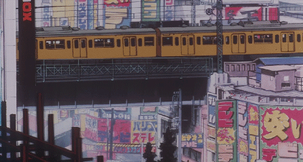
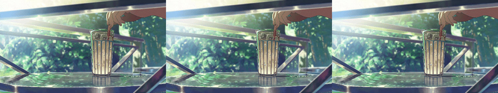
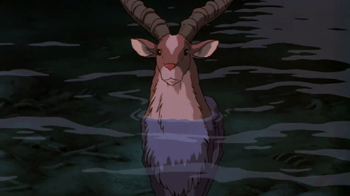

import DuoBox from '../../components/atomic/DuoBox.astro'

<figure><figcaption>Perfect Blue</figcaption></figure>

On est en 2012, je regarde une quantité assez impressionante de films et séries d'animation. J'adore ça au point de vouloir en garder des passages.

Je décide de créer un blog pour lequel je fabrique puis publie des gifs1 de mes oeuvres favorites ou de celles se prêtant à l'exercice. [xanatu](https://xanatu.tumblr.com)

1 Un [GIF](https://en.wikipedia.org/wiki/GIF) est une image souvent animée, elle est jouée et se répète en boucle automatiquement sur le web contrairement à la plupart des vidéos.

Ma technique (très limitée) consiste à parcourir la séquence qui m'intéresse image par image, à enregistrer ces images une par une, puis à les ré-assembler.

Et avec l'habitude, deux aspects se révèlent *très intriguants*.

---

**⯀ La répétition d'images**

Chaque image apparait deux, trois, quatre fois d'affilée. Je pense à un bug de mon lecteur vidéo, ça m'énerve, mais je prends l'habitude de sauter ou supprimer les doublons.

<figure><figcaption>The Garden of Words</figcaption></figure>

Bizarrement, les images de films d'animation sortis au cinéma (*Ghibli*, *Disney*) sont dupliquées une fois, ou alors pas du tout.

Pour les dessins animés aux budgets plus limités qui passent à la télé (*Dragon Ball*), les images se répètent jusque 3 ou 4 fois.

{/* Mais lors de scènes rapides (combat, course-poursuite), les images sont très souvent toutes différentes ... */}
{/* Des éléments comme la pluie changent à chaque image, alors que les personnages ne bougent que toutes les deux images ... */}

---

**⯀ La répétition de séquence**

Un gif se répète en boucle indéfiniment. La transition quand cette boucle arrive à sa fin et reprend du début est souvent un peu brutale.

Pour mes premiers essais je prends simplement des passages que je trouve cools et je n'y fais pas attention.
Mais lors d'un épisode je me rends compte d'un passage dans lequel les personnages reprennent exactement la même position qu'au début de la séquence.
Et ça donne un gif idéal dans lequel on ne distinge pas quand l'action recommence.

{/* Pour certaines oeuvres impossible de réussir à faire le moindre gif correct. L'animation ne s'y prête pas ou  */}

Je trouve régulièrement des "boucles parfaites"2, peu importe la qualité d'animation et le budget. C'est précisément ce que je commence à rechercher — l'action se répète sans transition.

2 La fumée monte lentement d'une cheminée dans le même mouvement, des personnages dansent et reviennent à leur position initiale avant de repartir pour un tour.

<figure><figcaption>Princesse Mononoke</figcaption></figure>

{/* Notre fumée s'élève donc dans le ciel pendant toute une scène alors que son mouvement se répète chaque seconde. 

Un personnage se transforme exactement de la même manière à chaque épisode. */}

{/* On imagine facilement que tout est très certainement lié à *l'argent* et au *temps*. Et puis je réalise que je n'ai qu'une très vague idée de la manière dont est conçu un dessin animé. */}
{/* 
Ce que je retiens pour le moment :

⯀ Chaque image d'un dessin animé n'est pas (forcément) unique 
⯀ Les animateurs ont l'air d'avoir plus d'un tour dans leur sac */}

 
 

## L'animation en bref

Ou pourquoi l'action parait parfois si réaliste, tandis qu'elle semble molle ou saccadée à d'autres moments ?

C'est quoi le cinéma, c'est quoi une vidéo, et pourquoi on fait comme ça. (en bref!)

*24fps* (http://www.grospixels.com/site/animation1.php)

<figure>
	
	<figcaption>Différence de perception des FPS</figcaption>
</figure>

*[extract] :*
Lorsqu'on regarde un film, ce que l'on voit en réalité, ce sont des images statiques diffusées l'une après l'autre très rapidement. Une sorte de diaporama, mais avec 24 diapositives par seconde. 
Chaque image est légèrement différente de la précédente, de telle sorte que le cerveau croit qu'il est en train d'en voir une seule en mouvement. 

Le processus est identique que l'on soit devant un écran de cinéma, de télévision ou d'ordinateur. Les seules choses qui changent sont la manière dont les images (en anglais frames) sont affichées (projection, tube cathodique...) et la vitesse du diaporama, ou framerate. On exprime celui-ci en images par seconde (IPS, ou FPS pour frames per second si vous êtes un inconditionnel de la langue de Britney Shakespeare). 

Pour vous faire un ordre d'idée, voici quelques framerates typiques:
- Film de cinéma : 24 FPS.
- Dessin animé de bonne qualité (Disney au cinéma) : 12 FPS, avec des pointes à 24 quand ils sortent les images de synthèse.
- Dessin animé de mauvaise qualité (Dragon Ball Z à la télé) : oscille entre 4 et 12 FPS, avec une moyenne aux alentours de 6.
- Jeu console PAL (EU) : 25 ou 50 FPS.
- Jeu console NTSC (US/JP) : 30 ou 60 FPS.

<figure>
	
	<figcaption>Différence des FPS selon les médias</figcaption>
</figure>

Dans le cadre d'un dessin animé traditionnel en 2D : 

<DuoBox one="24 frames" two ="1 seconde" />
<DuoBox one="1 heure" two ="3600 secondes" />
<DuoBox one="1h de film" two ="86400 dessins" />

---

- différence avec la 3D = dessin
- une image / un dessin = *une frame*
- 24 frames = *une seconde* (p-ê expliquer que c'est un choix stylistique + exemples)
- 1h = *3600 secondes*, donc ...
- 1h de film = *86400 dessins* : c'est **ENORME**, ça prend des années et c'est **CHER**

On est tout le temps en 24 FPS, Qu'est ce qui fait alors qu'on perçoit une différence entre différents dessins animés ? (rythme saccadé, lenteur, etc.)

## Les techniques

Comment réduire le nombre de dessins, comment combiner différentes méthodes, comment on peut voir à l'oeil quels studios ont des sous, quels types de dessins animés ont tendance à être quali.

### Vitesse

**⯀ One two three four**

Le nombre de dessins affiché par seconde varie en fonction du dessin animé !

On parle soit du nombre de répétitions : 2/3/4 -> twos/threes/fours, soit du nombre de dessins présents dans une seconde de film : 12/8/6

-> Tableau comparatif [2/3/4 -> 12/8/6]

<figure><figcaption>Comparaison d'une animation sur ones et twos</figcaption></figure>

-> Todo : image de comparaison maison [ones/twos/threes/fours]

Ce rythme et le nombre de dessins ne sont pas constants et varient très souvent au cours d'une même oeuvre !

Soit dans différentes scènes :  
Les moments phares (combats, scène de fin, etc.) sont animés de manière plus quali -> on augmente le nombre de dessins. 
Les scènes de dialogues ou plans "WOW" sont souvent lents et peu animés -> moins de dessins

Soit dans la même scène ! 
De la pluie tombe : ones facile a faire car répétitif ([Loops](#répétition)). 
Les personnages bougent : twos.
Un truc s'agite lentement en arrière plan : fours.

-> mélange twos/threes/fours & gifs (cache background/premier plan + neige/pluie ones) 

**⯀ Animation Bump, Overcrank & Undercrank**

Correspond au fait que lors de séquences "wouaw" l'animation est plus quali, dessins comme vitesse (donc souvent fours > twos etc.)
[AnimationBump](https://tvtropes.org/pmwiki/pmwiki.php/Main/AnimationBump)

On parle d'Overcrank quand on augmente le nombre de dessins par rapport à notre référentiel.
Pour l'Undercrank il s'agit de diminuer le nombre de dessins.

[Undercrank](https://tvtropes.org/pmwiki/pmwiki.php/Main/Undercrank)

[Overcrank](https://tvtropes.org/pmwiki/pmwiki.php/Main/Overcrank)

**⯀ Animation partielle**

eg: Un train animé passe tandis que le background reste complètement figé.
La météo est la seule chose animée.
Au contraire les personnages sont fixes tandis que les arbres bougent avec le vent.
etc.

---

### Mouvement

**⯀ Motion blur & Motion Parallax**

[exemple motion blur 24FPS](http://i.imgur.com/xnGbDts.gif)

[MotionBlur](https://tvtropes.org/pmwiki/pmwiki.php/Main/MotionBlur)

[MotionParallax](https://tvtropes.org/pmwiki/pmwiki.php/Main/MotionParallax)

[Multiplane Camera](https://en.wikipedia.org/wiki/Multiplane_camera)

**⯀ Traveling**

[Pan](https://tvtropes.org/pmwiki/pmwiki.php/Main/Pan)

---

### Répétition

**⯀ Réutilisation de séquence**

[Stock Footage](https://tvtropes.org/pmwiki/pmwiki.php/Main/StockFootage)

Répétitions mêmes animations (magical girls : Sailor Moon) 
[Transformation Sequence](https://tvtropes.org/pmwiki/pmwiki.php/Main/TransformationSequence)
<figure>

<figcaption>Sailor Moon</figcaption>
</figure>

**⯀ Recyclage de séquence**

réutilisation d'animations Disney (danse Mowgli + arsitochats il me semble)
[Recycled Animation](https://tvtropes.org/pmwiki/pmwiki.php/Main/RecycledAnimation)
<figure>

<figcaption>Blanche neige & Robin des Bois</figcaption>
</figure>

**⯀ Répétition de mouvement**

[Everybody Do The Endless Loop](https://tvtropes.org/pmwiki/pmwiki.php/Main/EverybodyDoTheEndlessLoop)

**⯀ Wraparound background**

[Wraparound Background](https://tvtropes.org/pmwiki/pmwiki.php/Main/WraparoundBackground)

---

### Rythme

**⯀ Leave the camera running**

[Leave The Camera Running](https://tvtropes.org/pmwiki/pmwiki.php/Main/LeaveTheCameraRunning)

**⯀ Limited Animation**

[Limited Animation](https://tvtropes.org/pmwiki/pmwiki.php/Main/LimitedAnimation)

**⯀ Lazy Lipsync**

[LipLock](https://tvtropes.org/pmwiki/pmwiki.php/Main/LipLock)

[Cheeky Mouth](https://tvtropes.org/pmwiki/pmwiki.php/Main/CheekyMouth)

[Motionless Chin](https://tvtropes.org/pmwiki/pmwiki.php/Main/MotionlessChin)

[Filming For Easy Dub](https://tvtropes.org/pmwiki/pmwiki.php/Main/FilmingForEasyDub)

est-ce que ... ?

## Un dessin animé en 24 fps ?

### Akira
	- vidéo
	- histoire + gifs + animation

	[It was all a lie ...](https://exploringakira.wordpress.com/2020/09/30/akira-the-24-frames-per-second-myth/)

### The Thief & the Cobbler
	- vidéo
	- animation + plans
	- histoire & Aladin (dans son propre article ? ou alors avec les 4 autres ? ou simplement refaire au propre Animation truc !!!)

	[It was all a lie AS WELL ARG](https://exploringakira.wordpress.com/2020/09/30/akira-the-24-frames-per-second-myth/)

## Mentions honorables

Dessins animés /animes

### Redline 
	- Redline - 7ans et 500000 dessins

### L'homme qui plantait des arbres	
	- L'homme qui plantait des arbres - solo/jsépacbddetps

### Les aventures du prince Achmed	
	- Les aventures du prince Achmed

### Le roi et l'oiseau ??
	- (+recherches a faire pour des autres)

## Divagations

Comment animer la course : https://animationobsessive.substack.com/p/hayao-miyazaki-on-running

## Conclusion ?

## Sources

*The Thief and the Cobbler*

- [movie](https://www.youtube.com/watch?v=bggDbbKyuXk)
- [wikipedia](https://en.wikipedia.org/wiki/The_Thief_and_the_Cobbler)
- [Richard Williams (wikipedia)](https://en.wikipedia.org/wiki/Richard_Williams_(animator))
- [Richard Williams documentary](https://www.google.fr/search?q=The+Thief+who+never+gave+up&ie=utf-8&oe=utf-8&gws_rd=cr&ei=cjYiV8rEH4H3Ury1lpAB)
- [Aladdin (wikipedia)](https://en.wikipedia.org/wiki/Aladdin_(1992_Disney_film))

*General*

- http://www.awn.com/forum/thread/1003230
- [L'homme qui plantait des arbres (frames)](https://www.google.fr/search?q=%22The+Man+Who+Planted+Trees%22+was+probably+done+on+fours&ie=utf-8&oe=utf-8&gws_rd=cr&ei=GY0iV8jDA4HpUKGygsAC#newwindow=1&safe=off&q=l%27homme+qui+plantait+des+arbres+nombre+de+dessins)
- [L'homme qui plantait des arbres (wikipedia)](https://en.wikipedia.org/wiki/The_Man_Who_Planted_Trees_(film))
- [reddit anime fps](https://www.reddit.com/r/anime/comments/2cw4ol/how_many_fps_does_anime_usually_have_just/)
- [redline animation](https://www.google.fr/search?q=Redline&ie=utf-8&oe=utf-8&gws_rd=cr&ei=R5EiV6eFI8KqUe_Fp6AO#newwindow=1&safe=off&q=Redline+animation)
- https://news.ycombinator.com/item?id=9534852