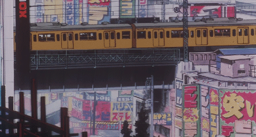
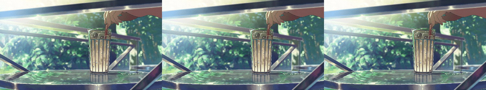
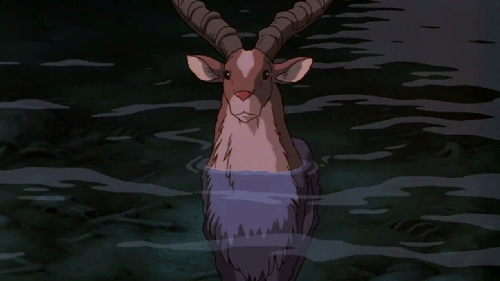

import Separator from '../../components/features/article/ArticleSeparator.astro'
import FrameRepetition from '@components/articles/animation/FrameRepetition.astro'
import FramesPerSecond from '@components/articles/animation/FramesPerSecond.astro'
import MotionBlur from '@components/articles/animation/MotionBlur.astro'
import MotionParallax from '@components/articles/animation/MotionParallax.astro'
import DrawingCount from '@components/articles/animation/DrawingCount.astro'
import OneTwoThreeFour from '@components/articles/animation/OneTwoThreeFour.astro'

<figure><figcaption>Perfect Blue</figcaption></figure>

{/* We're in 2012, I watch lots of animated content. Movies, series, shorts, everything I can put my hands on. */}

{/* I'm fond of animation, particularly 2D animation and its gorgeous painted backgrounds and realistic characters and movement. */}
I love animation, particularly hand-drawn 2D animation. My mom buying all kind of VHS movies when I was young probably played a huge part in this. I got to see stuff ranging from Disney's [Golden age](https://www.thedisneyclassics.com/blog/thedisneyeras), to dark japanese versions of Andersen's fairy tales (a *[Call of the Wild](https://www.imdb.com/title/tt12230096/)* where everyone dies, a *[Little Mermaid](https://en.wikipedia.org/wiki/Hans_Christian_Andersen%27s_The_Little_Mermaid_(1975_film))* where she evaporates in bubbles), to Ghibli movies I watched a bit too soon (hello *Princess Mononoke* and sliced body parts).

Years go by to circa 2012. My fondness has only developed. [insert why i'm not doing animation myself]. I want to keep fragments of moments I enjoy the most. Capturing screenshots seems fine at first, but these lack the very thing I want to capture - movement. I settle for something quite trendy at the time: Gifs1. 
The plan is set : I'll pick some sequence I enjoy, somehow make a GIF out of it and then make a [blog](https://xanatu.tumblr.com) to post these all.

1 A [GIF](https://en.wikipedia.org/wiki/GIF) is an animated image played on repeat.

***2012 GIF making recipe :***
1. Get to the sequence you want to record
2. Setup two media player shortcuts : *screenshot* & *go to next frame2* 
3. Run through the sequence, mashing shortcuts alternatively 
4. Open Editing software -> *do some magic* -> export as gif

2 A [frame](https://en.wikipedia.org/wiki/Film_frame) is one of the many single images in a motion picture.

The process is quite long and tedious, I probably stumbled upon a blog post saying this was the best method and instantly decided that was true. It doesn't take long to see that **something feels off ! Two things start catching my attention quite often ~**

### Frame repetition

When pressing *next frame* I often see no change at all. Same image, sometimes one, two, three times in a row. I think media player bug and brush it off, but soon find the pictures are indeed being repeated.

Images from feature movies that got theatrical releases *(Ghibli, Disney)* are most often duplicated once, or not at all. Limited budget media on the other hand *(Dragon Ball)* have most images being repeated 3 or even 4 times.

<FrameRepetition />

{/* <figure><figcaption>The Garden of Words</figcaption></figure> */}

### Sequence repetition

{/* A gif loops infinitely. The transition when the loops starts again can be somewhat *brutal*. During my first attempts I pick moments without paying attention to the stutter caused by the sudden repetition. */}

Eventually I come across a sequence where the image ends up looking exactly what it was seconds ago. The result is an ideal gif with perpetual uncut motion, where we can't distinguish start from end.
{/* Pour certaines oeuvres impossible de réussir à faire le moindre gif correct. L'animation ne s'y prête pas ou  */}

These *'perfect loops'* turn out to appear quite frequently, with seemingly no relation to animation quality or budget. They become precisely what I look for — action repeating infinitely without transition.

<figure><figcaption>Princesse Mononoke</figcaption></figure>

<Separator/>

## What is animation ?!

Before trying to understand why these pictures and moments repeat I ask myself : How does this actually all work ?
I have some clues : loads of drawings, but I don't really know how anything is done behind the scenes.

With cinema and motion capture : A video is simply a sequence of still images shown one after the other very quickly, a quick diaporama, but when do we go from one image to the next, how do we set the diaporama speed ?

### Frames per second

Let me introduce Frames per Second or **FPS** :
blablabla about fps, maybe talk about Hz for a bit
	

|60 FPS | 24 FPS |
|---|---|
|Matches the historical refresh rate of standard screens and offers a natural visual sweet spot| Lowest and cheapest speed that still created smooth motion when sound was added to film, nowadays used for its *'cinematic'* effect |

	{/* - 60fps : it matches the historical refresh rate of standard screens and offers a natural visual sweet spot
	- 24fps : standard because it was the lowest and cheapest speed that still created smooth motion when sound was added to film, nowadays used because it gives a *'cinematic'* effect */}

<FramesPerSecond />

This seems like a good start to understanding why some media appear so choppy or resembles a slideshow.
*But* (obviously there is a but) the industry standards since the end of silent movies can only project or display at 24 frames per second and up. 

### How this translates to 2D animation

2D animation always stuck with the cinema standard of 24FPS, so basically 24 images in a second.
Seeing how it is hand drawn would then mean 24 new drawings for each second. Let's imagine the result :

<DrawingCount />

This is an absurd amount of work, and would prove to be way too much time-consuming and costly even for the biggest studios. There definitely is a catch here, some media undeniably look like they have a lower framerate and feel jerky

## Methods and tricks

Comment réduire le nombre de dessins, comment combiner différentes méthodes, comment on peut voir à l'oeil quels studios ont des sous, quels types de dessins animés ont tendance à être quali.

### Speed / quantity

#### One two three four

Showing 24 frames per second doesn't mean showing 24 **different** frames per second.
This is very simply done by duping frames, with the more duplication giving rougher animation.

Animators talk about it in two ways. The number of repetitions : 2 / 3 / 4, animating on twos, threes, fours. Or the number of different drawings in one second :  12 / 8 / 6.

<OneTwoThreeFour />

{/* - Tableau comparatif [2/3/4 -> 12/8/6]
- Todo : image de comparaison maison [ones/twos/threes/fours] */}

{/* <figure><figcaption>Comparaison d'une animation sur ones et twos</figcaption></figure> */}

Ce rythme et le nombre de dessins ne sont pas constants et varient très souvent au cours d'une même oeuvre !

Soit dans différentes scènes :  
Les moments phares (combats, scène de fin, etc.) sont animés de manière plus quali -> on augmente le nombre de dessins. 
Les scènes de dialogues ou plans "WOW" sont souvent lents et peu animés -> moins de dessins

Soit dans la même scène ! 
De la pluie tombe : ones facile a faire car répétitif ([Loops](#répétition)). 
Les personnages bougent : twos.
Un truc s'agite lentement en arrière plan : fours.

-> mélange twos/threes/fours & gifs (cache background/premier plan + neige/pluie ones) 

#### Animation Bump, Overcrank & Undercrank

Correspond au fait que lors de séquences "wouaw" l'animation est plus quali, dessins comme vitesse (donc souvent fours > twos etc.)
[AnimationBump](https://tvtropes.org/pmwiki/pmwiki.php/Main/AnimationBump)

On parle d'[Overcrank](https://tvtropes.org/pmwiki/pmwiki.php/Main/Overcrank) quand on augmente le nombre de dessins par rapport à notre référentiel.
Pour l'[Undercrank](https://tvtropes.org/pmwiki/pmwiki.php/Main/Undercrank) il s'agit de diminuer le nombre de dessins.

{/* <figure>
<figcaption>King Dedede glowup</figcaption></figure> */}

#### Limited Animation

Limited animation is a process that reuses frames of character animation (either full or simply body parts).
[Limited Animation](https://tvtropes.org/pmwiki/pmwiki.php/Main/LimitedAnimation)

### Movement / Camera work

#### Partial animation

eg: Un train animé passe tandis que le background reste complètement figé.
La météo est la seule chose animée.
Au contraire les personnages sont fixes tandis que les arbres bougent avec le vent.
etc.

#### Motion blur & Motion Parallax

{/* <figure>
<figcaption>The effects of motion blur</figcaption></figure>
[exemple motion blur 24FPS](http://i.imgur.com/xnGbDts.gif) */}

##### Motion blur

{/* - [MotionBlur](https://tvtropes.org/pmwiki/pmwiki.php/Main/MotionBlur)  */}

This method is used to artificially reproduce the blur created by movement in our field of vision or in real motion pictures. It is used by either literally blurring the characters or background, stretching the object in motion (smear), or showing it multiple times. 

<MotionBlur />

##### Motion Parallax

{/* [MotionParallax](https://tvtropes.org/pmwiki/pmwiki.php/Main/MotionParallax) */}

Motion Parallax is a technic using different layers moving at different speeds to simulate depth (the farther being the slower). It is also very much used in video games and very visible in the *Mario* franchise for example. This will often be used with background, trees being on their own layer, then mountains, then the sky ...

<MotionParallax />

This effect was first made possible with the use of the famous [Multiplane Camera](https://en.wikipedia.org/wiki/Multiplane_camera)

#### Pan & Dolly & Zoom

##### Pan

{/* [Pan](https://tvtropes.org/pmwiki/pmwiki.php/Main/Pan) */}

For panning the background is a very large piece and instead of drawing it multiple times it is simply sled under the camera (which is fixed in place) to produce movement with a single drawing. The movement follows the x & y axes, making the scene move left, right, up or down. 

##### Dolly & zoom

{/* [Dolly](https://tvtropes.org/pmwiki/pmwiki.php/Main/Dolly)
[Zoom](https://tvtropes.org/pmwiki/pmwiki.php/Main/Zoom) */}

Dolly is a similar effect but instead of moving either left & right or up & down the scene gets closer or farther. The real Dolly effect involves moving the camera closer or farther to the picture. The effect used the most is siply zooming in and out, since without a parallax setup it will produce the same result for 2D animation. (In live action the effects are different, the depth of the image being changed)

### Recycling

#### Recycled Sequence

{/* [Stock Footage](https://tvtropes.org/pmwiki/pmwiki.php/Main/StockFootage) */}

Basically showing exactly the same thing at different points in the media. It is very often used on cheap productions and long series, the most noticeable examples can be found in the magical girl genre (*Sailor Moon*) with the [Transformation Sequence](https://tvtropes.org/pmwiki/pmwiki.php/Main/TransformationSequence).

<figure>
<figcaption>Sailor Moon</figcaption></figure>

#### Recycled Animation

This is very close to the previous trick *EXCEPT* it is used cross-media. Disney is pretty famous for this with the same dances going on in different movies. There are changes, characters and drawings are modified to match the current movie but the groundwork for the animation and movement is already done.
{/* réutilisation d'animations Disney (danse Mowgli + arsitochats il me semble) */}
{/* [Recycled Animation](https://tvtropes.org/pmwiki/pmwiki.php/Main/RecycledAnimation) */}

<figure>
<figcaption>White snow and Robin Hood</figcaption></figure>

#### Recycled movement

This is what made me realise there were loops in animation, [the characters come to the same position](https://tvtropes.org/pmwiki/pmwiki.php/Main/EverybodyDoTheEndlessLoop) they had at some point, and the movement starts again. This saves time by using the same frames several times.

It is often used for part of the animation. Character movement, weather, particles ... It is very visible with weather like snowflakes, waterfalls etc.
{/* 
#### Recycled background

Mostly used in Hannah Barbera was the [Wraparound Background](https://tvtropes.org/pmwiki/pmwiki.php/Main/WraparoundBackground) which is a Pan+ where the background is made to seamlessly loop. You'll see the same 2 trees and 3 houses several times while the characters run or drive by. */}

{/* ### Rythm

#### Leave the camera running

When the scene has ended but it takes time, too much time, to get to the next one. It is often used in cheap animation to scrape for some seconds. It is often very visible because the scene is completely still for some seconds, or with a slow pan showing nothing more really. */}

{/* [Leave The Camera Running](https://tvtropes.org/pmwiki/pmwiki.php/Main/LeaveTheCameraRunning) */}

{/* #### Lazy Lipsync

- [LipLock](https://tvtropes.org/pmwiki/pmwiki.php/Main/LipLock)
- [Cheeky Mouth](https://tvtropes.org/pmwiki/pmwiki.php/Main/CheekyMouth)
- [Motionless Chin](https://tvtropes.org/pmwiki/pmwiki.php/Main/MotionlessChin)
- [Filming For Easy Dub](https://tvtropes.org/pmwiki/pmwiki.php/Main/FilmingForEasyDub)

est-ce que ... ? */}

## Un dessin animé en 24 fps ?

### Akira
	- vidéo
	- histoire + gifs + animation

	[It was all a lie ...](https://exploringakira.wordpress.com/2020/09/30/akira-the-24-frames-per-second-myth/)

### The Thief & the Cobbler
	- vidéo
	- animation + plans
	- histoire & Aladin (dans son propre article ? ou alors avec les 4 autres ? ou simplement refaire au propre Animation truc !!!)

	#todo :: update link
	[It was all a lie AS WELL ARG](https://google.com/)

## Mentions honorables

Dessins animés /animes

### Redline 
Redline - 7ans et 500000 dessins

### L'homme qui plantait des arbres	
L'homme qui plantait des arbres - solo/jsépacbddetps

### Les aventures du prince Achmed	
Les aventures du prince Achmed

### Le roi et l'oiseau ??
(+recherches a faire pour des autres)

{/* ## Divagations

[Hayao Miyazaki on Running](https://animationobsessive.substack.com/p/hayao-miyazaki-on-running) */}

{/* ## Conclusion ? */}

## Sources
todo :: source images and every link used

### The Thief and the Cobbler

- [movie](https://www.youtube.com/watch?v=bggDbbKyuXk)
- [wikipedia](https://en.wikipedia.org/wiki/The_Thief_and_the_Cobbler)
- [Richard Williams (wikipedia)](https://en.wikipedia.org/wiki/Richard_Williams_(animator))
- [Richard Williams documentary](https://www.google.fr/search?q=The+Thief+who+never+gave+up&ie=utf-8&oe=utf-8&gws_rd=cr&ei=cjYiV8rEH4H3Ury1lpAB)
- [Aladdin (wikipedia)](https://en.wikipedia.org/wiki/Aladdin_(1992_Disney_film))

### General

- [L'homme qui plantait des arbres (frames)](https://www.google.fr/search?q=%22The+Man+Who+Planted+Trees%22+was+probably+done+on+fours&ie=utf-8&oe=utf-8&gws_rd=cr&ei=GY0iV8jDA4HpUKGygsAC#newwindow=1&safe=off&q=l%27homme+qui+plantait+des+arbres+nombre+de+dessins)
- [L'homme qui plantait des arbres (wikipedia)](https://en.wikipedia.org/wiki/The_Man_Who_Planted_Trees_(film))
- [reddit anime fps](https://www.reddit.com/r/anime/comments/2cw4ol/how_many_fps_does_anime_usually_have_just/)
- [redline animation](https://www.google.fr/search?q=Redline&ie=utf-8&oe=utf-8&gws_rd=cr&ei=R5EiV6eFI8KqUe_Fp6AO#newwindow=1&safe=off&q=Redline+animation)
- [Fundamental difference between Japanese and Western animation ](https://news.ycombinator.com/item?id=9534852)
- [Sakuga Animation](https://www.liveabout.com/sakuga-animation-in-anime-144807)